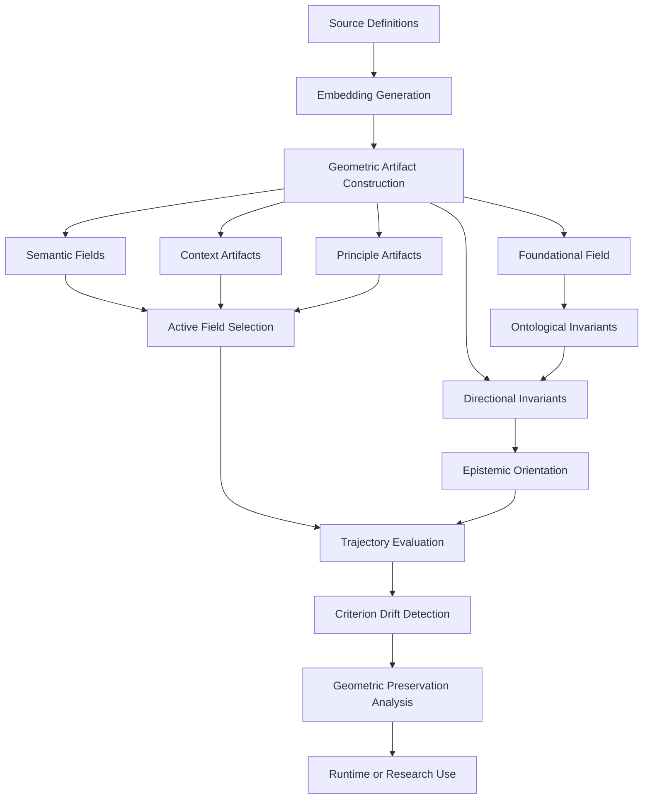

# Axiomatic Criterion Atlas (ACA)

**Persistent Geometry for Criterion Orientation in Generative Systems**


[](https://doi.org/10.5281/zenodo.20630867)

---

## Overview

The **Axiomatic Criterion Atlas (ACA)** is a reproducible framework for constructing persistent geometric artifacts that support criterion orientation in generative systems.

ACA addresses a central problem in long-horizon reasoning:

> A generative system may remain fluent, coherent, and semantically close to a context while progressively losing the criterion that should guide interpretation.

ACA does not attempt to replace human judgment. It provides an external geometric substrate for preserving, measuring, and supervising semantic orientation across evolving trajectories.

---

## Central Thesis

> **The dialogue should not transport the criterion.**
> **The criterion should transport the dialogue.**

Instead of reconstructing judgment through repeated prompts, ACA externalizes criterion into persistent artifacts: semantic fields, invariant structures, directional poles, orientation measures, drift signals, and preservation conditions.

---

## What ACA Is

ACA is:

* a methodology for constructing geometric semantic artifacts;
* a repository of reproducible criterion-oriented structures;
* a framework for measuring epistemic orientation;
* a foundation for runtime systems such as ACA Runtime;
* an experimental infrastructure for detecting criterion drift and preserving trajectory stability.

ACA is not:

* a universal truth engine;
* a consciousness model;
* a complete moral reasoning system;
* a replacement for human responsibility;
* a standalone runtime supervisor;
* an infallible classifier.

**Defensible claim:** ACA provides a reproducible methodology for constructing persistent geometric artifacts that support operational criterion preservation in generative systems.

---

## Core Idea

ACA distinguishes between two different forms of stability:

```text
Contextual Compatibility
≠
Criterion Preservation
```

A trajectory may remain contextually compatible while losing orientation.

ACA therefore evaluates not only where a semantic trajectory belongs, but whether it preserves the invariant structures that give that field direction.

---

## Foundational Structure

ACA is built on a foundational invariant layer divided into two operational cores:

```text
Foundational Field =
Logical-Epistemic Core
+
Operational-Orientational Core
```

### Logical-Epistemic Core

This core contains invariants required for reality-based evaluation:

* identity;
* non_contradiction;
* correspondence;
* evidence_constraint;
* causal_continuity;
* uncertainty_preservation.

### Operational-Orientational Core

This core contains invariants required for stable semantic operation within a declared origin and context:

* persistence;
* relation;
* semantic_stability;
* interpretive_constraint;
* field_boundary;
* orientation_continuity.

Together, these invariants define what must remain stable for a trajectory to preserve criterion.

---

## Criterion Architecture

ACA organizes criterion preservation through the following conceptual layers:

```text
Origin / Context
        ↓
Foundational Field
        ↓
Ontological Invariants
        ↓
Directional Invariants
        ↓
Epistemic Orientation
        ↓
Criterion Drift
        ↓
Geometric Preservation
```

### Origin and Context

ACA does not evaluate orientation in isolation. Before orientation can be interpreted, the system must identify:

* declared origin of criterion;
* active semantic field;
* relevant context;
* applicable invariants;
* trajectory state or sequence under evaluation.

### Ontological Invariants

Ontological invariants define the stable structures that must be preserved for criterion to remain meaningful.

### Directional Invariants

Directional invariants translate foundational invariants into measurable semantic axes using preservation and inversion poles.

### Epistemic Orientation

Epistemic orientation measures whether a semantic state preserves or inverts the criterion-preserving direction of the active field.

### Criterion Drift

Criterion drift occurs when a trajectory remains contextually coherent while progressively weakening, displacing, or inverting the invariant structures that preserve criterion.

### Geometric Preservation

Geometric preservation defines the stability condition of ACA:

```text
geometric preservation =
contextual compatibility
+
positive epistemic orientation
+
trajectory preservation
```

---

## Triaxial Criterion Projection

ACA also includes the **Triaxial Criterion Projection (F–C–P)**:

```text
K = (F, C, P)
```

* **F — Foundation:** What reference mode supports the statement?
* **C — Context:** In what relational trajectory is meaning operating?
* **P — Principle:** What operational principle is being preserved?

Example axes:

* **Foundation:** factual, fictional, hypothetical;
* **Context:** research, training, manipulation, narrative;
* **Principle:** investigate, teach, protect, exploit.

The triaxial projection is not a separate atlas. It is a diagnostic projection over the broader ACA artifact structure.

---

## Derived Field Examples

Operational fields emerge from stable F–C–P configurations:

| Derived Field      | F — Foundation         | C — Context  | P — Principle |
| ------------------ | ---------------------- | ------------ | ------------- |
| scientific_inquiry | factual                | research     | investigate   |
| security_training  | factual / hypothetical | training     | protect       |
| phishing_attack    | hypothetical           | manipulation | exploit       |
| fictional_teaching | fictional              | narrative    | teach         |

---

## Core Architecture



---

## Artifact Structure

```text
artifacts/
├── foundational/
│   ├── basis_vectors.npy
│   ├── criterion_vectors.npy
│   ├── criterion_vector_metadata.json
│   ├── invariant_directions.npy
│   ├── invariant_metadata.json
│   ├── field_metadata.json
│   └── singular_values.npy
├── factual/
├── fictional/
├── hypothetical/
├── rhetorical/
├── context/
│   ├── research/
│   ├── training/
│   ├── manipulation/
│   └── narrative/
├── principle/
│   ├── investigate/
│   ├── teach/
│   ├── protect/
│   └── exploit/
├── triaxial/
│   └── manifest.json
├── source_definitions/
│   └── triaxial_artifact_sources.json
└── validation/
    └── triaxial_validation_cases.json
```

---

## Repository Structure

```text
axiomatic-criterion-atlas/
├── CORE/                  # Foundational criterion architecture
├── artifacts/             # Generated geometric artifacts
├── atlas/                 # Artifact construction and invariant geometry
├── aca_runtime/           # Initial runtime interface
├── datasets/              # Source definitions and validation data
├── docs/                  # Extended documentation
├── tools/                 # Build and validation scripts
├── benchmarks/            # Evaluation experiments
├── notebooks/             # Interactive experiments
├── paper/                 # Academic paper material
└── README.md
```

---

## Quick Start

```bash
# Clone the repository
git clone https://github.com/rosatisoft/axiomatic-criterion-atlas.git
cd axiomatic-criterion-atlas

# Install dependencies
pip install -r requirements.txt

# Validate triaxial artifacts
python tools/validate_triaxial_artifacts.py

# Validate diagnostic layer
python tools/validate_triaxial_diagnostics.py
```

---

## Recommended Reading Order

1. `CORE/atlas_axioms.md`
2. `CORE/foundational_field.md`
3. `CORE/ontological_invariants.md`
4. `CORE/directional_invariants.md`
5. `CORE/epistemic_orientation.md`
6. `CORE/criterion_drift.md`
7. `CORE/geometric_preservation.md`
8. `docs/atlas_criterion_preservation_paradigm.md`
9. `docs/triaxial_artifact_methodology.md`
10. `docs/triaxial_validation_self_assessment.md`

---

## Relation to ACA Runtime

ACA and ACA Runtime are distinct but complementary.

* **ACA:** methodology, artifacts, invariant structures, and criterion geometry.
* **ACA Runtime:** operational layer that applies ACA artifacts for input evaluation, trajectory memory, supervision, drift detection, and policy decisions.

Runtime repository:

```text
https://github.com/rosatisoft/aca-runtime
```

---

## Validation Results

Current validation work includes:

* triaxial artifact validation;
* diagnostic projection validation;
* trajectory-level criterion evaluation;
* runtime token-efficiency benchmarks;
* drift and ambiguity detection experiments.

Earlier validation results included:

* 100 individual validation cases;
* 85.71% axis accuracy;
* 6/6 trajectory matches;
* 36 diagnostic cases with 90.16% recall.

These results are experimental and should be interpreted as methodological evidence, not final performance guarantees.

---

## Academic Reference

**Title:** *Axiomatic Criterion Atlas (ACA): Persistent Geometry-Based Semantic Navigation*
**Author:** Ernesto Rosati Beristain
**Repository:** `rosatisoft/axiomatic-criterion-atlas`

Current DOI references should be verified against the latest Zenodo release before publication or citation.

### Citation Template

```bibtex
@article{rosati2026aca,
  title={Axiomatic Criterion Atlas (ACA): Persistent Geometry-Based Semantic Navigation},
  author={Rosati Beristain, Ernesto},
  year={2026},
  doi={10.5281/zenodo.20630867}
}
```

---

## Status and Limitations

ACA v0.3 is experimental and methodological.

It does not claim:

* universal truth verification;
* consciousness;
* moral certainty;
* complete semantic coverage;
* infallibility;
* replacement of human judgment or responsibility.

It does claim to provide a reproducible infrastructure for geometric orientation and operational criterion preservation in generative systems.

---

## Roadmap

* [ ] Expand trajectory validation.
* [ ] Improve out-of-field and evidence distortion detection.
* [ ] Separate evidence distortion into a dedicated diagnostic projection.
* [ ] Develop objective vector alignment.
* [ ] Integrate declared shift and undeclared shift handling.
* [ ] Strengthen origin and context declaration mechanisms.
* [ ] Expand foundational drift detection.
* [ ] Deepen integration with ACA Runtime.
* [ ] Synchronize paper with the v0.3 criterion architecture.
* [ ] Prepare updated Zenodo release and citation metadata.

---

## License

Distributed under the **Apache License 2.0**. See `LICENSE` for more information.

---

## Final Perspective

ACA proposes a transition:

```text
from prompt-based semantic reconstruction
to persistent geometry-based criterion infrastructure
```

Reliable long-horizon generative reasoning depends not only on larger models, longer prompts, or stronger policies.

It also depends on preserving the orientation of meaning as context evolves.

**Built with epistemic rigor and technical humility.**
