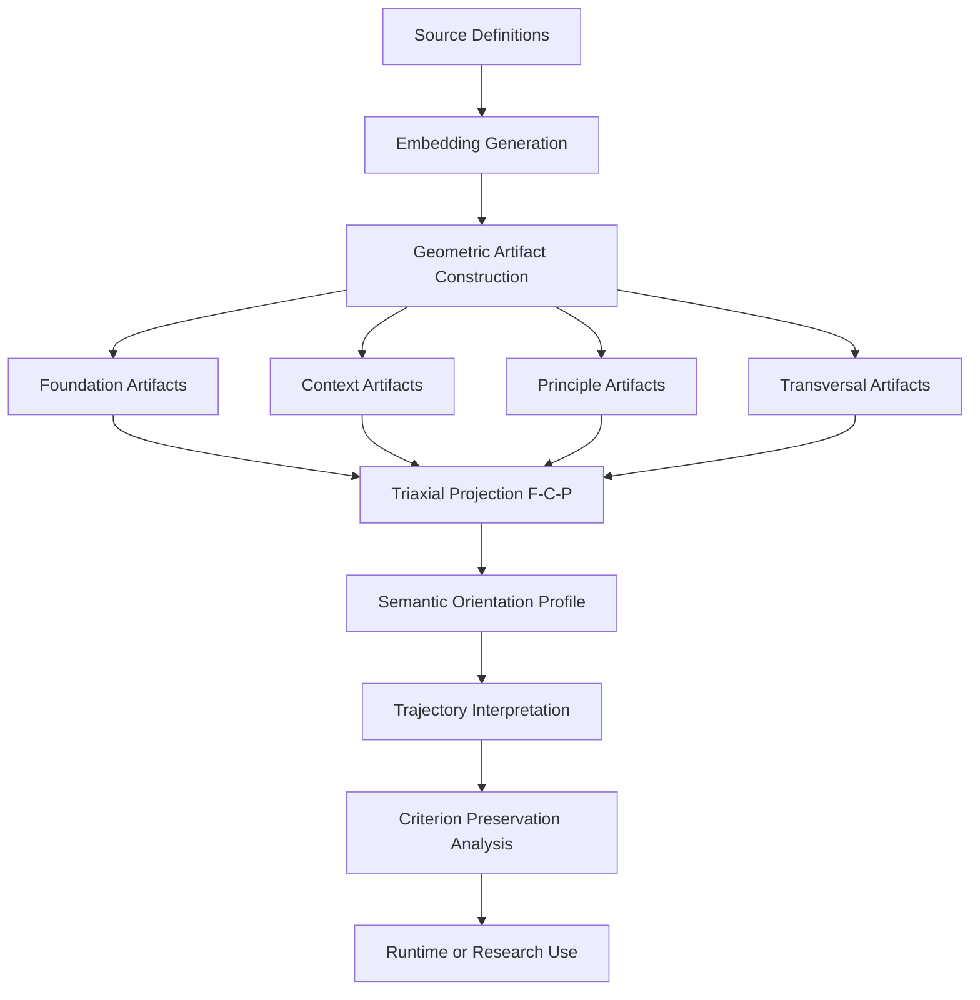

# Axiomatic Criterion Atlas (ACA)

**Geometric Context Artifacts for Persistent Semantic Orientation**


[](https://doi.org/10.5281/zenodo.20630867)

This repository is the reproducible artifact companion to:

Axiomatic Criterion Atlas (ACA): Persistent Geometry-Based Semantic Navigation  
DOI: 10.5281/zenodo.20630437

In an era where generative models can be **highly fluent yet progressively disoriented**, ACA offers a different approach: instead of relying solely on prompts to reconstruct criterion in every interaction, we build **persistent geometric artifacts** that preserve semantic orientation across long conversations, complex projects, and semantic drift.

### Central Thesis

> **The dialogue should not transport the criterion.** 

> **The criterion should transport the dialogue.**

---

## What is ACA?

**ACA** (Axiomatic Criterion Atlas) is a **reproducible methodology** for constructing geometric semantic maps — called **artifacts** — that enable the measurement and preservation of criterion orientation in generative systems.

**ACA is:**
* A methodology for building geometric semantic artifacts
* A repository of reproducible artifact structures
* A framework for semantic orientation and criterion preservation
* The foundational layer for operational systems like **ACA Runtime**

**ACA is not:**
* A universal truth engine
* A consciousness model
* A complete moral reasoning system
* A replacement for human judgment
* A standalone runtime supervisor

**Defensible claim:** ACA provides a reproducible methodology for constructing **persistent geometric artifacts** that support operational criterion preservation in generative systems.

---

## Current Version: ACA v0.3 — Persistent Geometry-Based Semantic Navigation

Version 0.2 introduces the **Triaxial Criterion Projection (F–C–P)** as a central projection of the Atlas:

* **F — Foundation**: What reference mode supports the statement?
* **C — Context**: In what relational trajectory is the meaning operating?
* **P — Principle**: What operational principle is being preserved?

This triaxial structure is not a separate atlas — it is a powerful projection over existing artifacts.

### Derived Fields Examples
Operational fields emerge from stable F–C–P configurations:

| Derived Field | F (Foundation) | C (Context) | P (Principle) |
| :--- | :--- | :--- | :--- |
| **scientific_inquiry** | factual | research | investigate |
| **security_training** | factual/hypothetical | training | protect |
| **phishing_attack** | hypothetical | manipulation | exploit |
| **fictional_teaching** | fictional | narrative | teach |

---

## Core Architecture



---

### Triaxial Criterion Projection (F–C–P)

$$K = (F, C, P)$$

* **Foundation** $\rightarrow$ factual, fictional, hypothetical
* **Context** $\rightarrow$ research, training, manipulation, narrative
* **Principle** $\rightarrow$ investigate, teach, protect, exploit

#### Key Finding from v0.2:

> *Criterion is better observed in semantic trajectories than in isolated classifications.*

**Example:**

* $\text{research} \rightarrow \text{research} \rightarrow \text{research} \rightarrow \textbf{preservation}$
* $\text{research} \rightarrow \text{research} \rightarrow \text{manipulation} \rightarrow \textbf{potential drift or criterion inversion}$

---

## Artifact Structure

```text
artifacts/
├── foundational/
├── factual/
├── fictional/
├── hypothetical/
├── rhetorical/
├── context/
│   ├── research/
│   ├── training/
│   ├── manipulation/
│   └── narrative/
├── principle/
│   ├── investigate/
│   ├── teach/
│   ├── protect/
│   └── exploit/
├── triaxial/
│   └── manifest.json
├── source_definitions/
│   └── triaxial_artifact_sources.json
└── validation/
    └── triaxial_validation_cases.json

```

---

## Repository Structure

```text
axiomatic-criterion-atlas/
├── artifacts/              # Core geometric artifacts
├── docs/                   # In-depth documentation
├── tools/                  # Build and validation scripts
├── paper/                  # Academic version
├── aca_runtime/            # Initial runtime framework
├── notebooks/              # Interactive experiments
└── README.md

```

---

## Quick Start

```bash
# Clone the repository
git clone https://github.com/rosatisoft/axiomatic-criterion-atlas.git
cd axiomatic-criterion-atlas

# Install dependencies
pip install -r requirements.txt

# Validate triaxial artifacts
python tools/validate_triaxial_artifacts.py

# Validate diagnostic layer
python tools/validate_triaxial_diagnostics.py

```

---

## Validation Results (v0.2)

* **100** individual validation cases
* **85.71%** axis accuracy
* **6/6** trajectory matches
* **36** diagnostic cases (**90.16%** recall)

---

## Relation to ACA Runtime

* **ACA:** Methodology and geometric artifacts (this repository).
* **ACA Runtime:** Operational layer that applies the artifacts (precondition gate, trajectory memory, supervision, etc.).
* **Runtime Repository:** [github.com/rosatisoft/aca-runtime](https://github.com/rosatisoft/aca-runtime)

---

## Recommended Documents (Suggested Reading Order)

1. `docs/atlas_criterion_preservation_paradigm.md`
2. `docs/triaxial_artifact_methodology.md`
3. `docs/triaxial_validation_self_assessment.md`
4. `docs/ACA_v0.2_ZENODO_CHANGELOG.md`
5. `docs/RESULTS_RUNTIME_BENCHMARK.md`
6. `docs/MILESTONE_01_RUNTIME.md`

---

## Academic Paper

* **Title:** *Axiomatic Criterion Atlas (ACA): Persistent Geometry-Based Semantic Navigation*
* **Author:** Ernesto Rosati Beristain
* **Current DOI:** [10.5281/zenodo.20250559](https://doi.org/10.5281/zenodo.20250559)

### Companion Methodology

* **Title:** *From Emergent Geometry to Persistent Criterion: A Companion Methodology for Attractor Selection, Invariant Justification, and Artifact Promotion in ACA*
* **Author:** Ernesto Rosati Beristain
* **File:** `paper/companion_methodology.pdf`

> **Note:** The paper DOI currently refers to the earlier paper version. The paper is being synchronized with v0.3 advances. ACA v0.3 introduces additional triaxial artifact methodology and should be cited through the corresponding GitHub/Zenodo release once the v0.3 software/artifact DOI is assigned.

### Citation

```cite
@article{rosati2026aca,
  title={Axiomatic Criterion Atlas (ACA): Persistent Geometry-Based Semantic Navigation},
  author={Rosati Beristain, Ernesto},
  year={2026},
  doi={10.5281/zenodo.20250559}
}

```

---

## Status and Limitations

* ACA v0.3 is **experimental and methodological**.
* It **does not claim** universal truth verification, consciousness, moral certainty, full semantic coverage, or infallibility.
* It **does claim** to provide a reproducible infrastructure of geometric orientation for operational criterion preservation, ensuring human judgment is supported rather than replaced.

---

## Roadmap

* [ ] Expand trajectory validation
* [ ] Improve out-of-field and evidence distortion detection
* [ ] Separate evidence distortion into a dedicated diagnostic projection
* [ ] Develop objective vector alignment
* [ ] Integrate declared shift / undeclared shift handling
* [ ] Deeper integration with ACA Runtime
* [ ] Full paper synchronization with v0.2
* [ ] Release specific DOI for v0.2 artifacts

---

## License

Distributed under the **Apache License 2.0**. See `LICENSE` for more information.

---

## Final Perspective

ACA proposes a fundamental transition:


$$\text{From prompt-based semantic reconstruction} \longrightarrow \text{To persistent geometry-based criterion infrastructure}$$

Because reliable long-horizon generative reasoning depends not only on larger models or longer prompts, but on preserving the orientation of meaning as context evolves.

---

*Interested in contributing? Check `CONTRIBUTING.md` or open an Issue.*

**Built with epistemic rigor and technical humility.**

```
