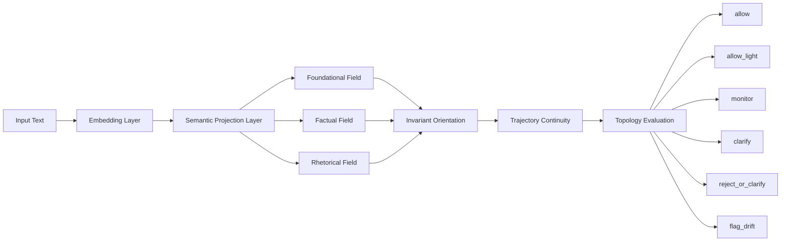

# Axiomatic Criterion Atlas (ACA)

### Persistent Geometry-Based Semantic Navigation

[](https://doi.org/10.5281/zenodo.20250560)
[](http://www.apache.org/licenses/)
[]()
[]()

ACA (Axiomatic Criterion Atlas) is a geometry-based criterion supervision framework designed to preserve semantic orientation during generative reasoning.

Rather than reconstructing reasoning constraints through repeated prompt engineering, ACA externalizes semantic criterion into persistent geometric infrastructure composed of:

* semantic fields,
* invariant orientation,
* contextual topology,
* trajectory continuity,
* and topology-aware runtime supervision.

The framework separates contextual compatibility from epistemic integrity, allowing semantic systems to detect criterion drift even when language remains fluent and contextually coherent.

---

# Central Thesis

\text{Contextual Coherence}\neq\text{Epistemic Integrity}

ACA proposes that reliable generative reasoning requires more than semantic compatibility alone.

A reasoning trajectory may remain:

* fluent,
* persuasive,
* and contextually coherent,

while progressively inverting the foundational structure that originally constrained its semantic orientation.

ACA models this phenomenon geometrically.

---

# Why ACA Exists

Modern LLM systems frequently preserve reasoning stability through:

* repeated prompt reinforcement,
* alignment instructions,
* contextual accumulation,
* retrieval injection,
* and post-generation filtering.

These approaches improve local coherence, but they often reconstruct criterion repeatedly during interaction.

As reasoning trajectories grow, this produces:

* escalating prompt overhead,
* semantic fragility,
* contextual saturation,
* and unstable long-horizon continuity.

ACA introduces a different formulation:

> semantic criterion should persist structurally, not linguistically.

Instead of repeatedly reintroducing semantic constraints as text, ACA externalizes criterion into reusable geometric semantic infrastructure.

---

# Core Runtime Architecture

ACA Runtime supervises semantic evolution through contextual geometry and invariant continuity.



---

# Runtime Pipeline

```text
Input
  ↓
Embedding
  ↓
Semantic Projection
  ↓
Field Selection
  ↓
Invariant Orientation
  ↓
Trajectory Supervision
  ↓
Topology Evaluation
  ↓
Runtime Decision
```

ACA does not attempt to exhaustively encode every semantic possibility.

Instead, it preserves:

* navigability,
* orientation continuity,
* contextual recoverability,
* and criterion stability

through structured semantic topology.

---

# Core Concepts

## Semantic Fields

ACA models contextual domains as geometric semantic subspaces constructed from anchor relations.

Examples:

* foundational fields,
* factual fields,
* legal fields,
* rhetorical fields,
* operational fields.

---

## Origin Cost

Contextual compatibility is measured through geometric projection residuals.

O_S(z)=||z-\Pi_S(z)||^2

Low origin cost indicates strong contextual compatibility with a semantic field.

---

## Directional Invariants

ACA introduces invariant orientation vectors that distinguish:

* criterion preservation,
* from criterion inversion.

Each invariant is represented as a directional semantic axis.

---

## Epistemic Orientation

\phi_i(z)=\langle \hat{z}, d_i \rangle

Positive orientation:

* invariant preservation

Negative orientation:

* criterion inversion

---

# Runtime Decisions

| Runtime State       | Meaning                            |
| ------------------- | ---------------------------------- |
| `allow`             | stable continuity                  |
| `allow_light`       | neighboring semantic reorientation |
| `monitor`           | uncertain continuity               |
| `clarify`           | ambiguous positioning              |
| `reject_or_clarify` | unresolved incompatibility         |
| `flag_drift`        | criterion inversion detected       |

---

# Semantic Topology

ACA treats reasoning as navigable movement across structured semantic topology.

Not all contextual transitions are destabilizing.

For example:

```text
foundational ↔ factual
```

may preserve orientation continuity through semantic reorientation.

Whereas:

```text
foundational → rhetorical → inversion
```

frequently produces criterion destabilization.

ACA therefore supervises:

* neighboring continuity,
* transition compatibility,
* orientation persistence,
* and semantic recovery.

---

# Experimental Findings

The experiments demonstrate that:

* semantic trajectories can remain contextually coherent while losing epistemic orientation,
* rhetorical pressure can progressively invert invariant structure,
* criterion drift becomes geometrically measurable,
* and topology-aware supervision can stabilize semantic continuity.

---

# Runtime Efficiency Benchmark

ACA externalizes semantic criterion from repeated prompt reconstruction into persistent geometric infrastructure.

Experimental runtime comparison:

| Runtime Strategy                      | Total Tokens |
| ------------------------------------- | ------------ |
| Prompt-heavy criterion reconstruction | 5,892        |
| ACA Runtime supervision               | 1,752        |

Result:

# 70.26% Runtime Token Reduction

This reduction was achieved without removing semantic supervision.

The efficiency emerged because criterion became reusable semantic structure rather than repeated natural-language reconstruction.

---

# Repository Structure

```text
axiomatic-criterion-atlas/

├── notebooks/
│   ├── experiments/
│   ├── benchmarks/
│   ├── topology_analysis/
│   └── visualization/
│
├── aca/
│   ├── runtime/
│   ├── semantic_fields/
│   ├── invariants/
│   ├── topology/
│   └── policies/
│
├── datasets/
│
├── docs/
│   ├── figures/
│   ├── theory/
│   └── runtime/
│
├── tests/
│
├── examples/
│
└── README.md
```

---

# Quick Start

## Clone the repository

```bash
git clone https://github.com/rosatisoft/axiomatic-criterion-atlas.git

cd axiomatic-criterion-atlas
```

---

## Install dependencies

```bash
pip install -r requirements.txt
```

---

## Run notebook experiments

```bash
jupyter notebook
```

Open:

```text
notebooks/
```

---

## Example Runtime Flow

```python
from aca.runtime import ACAEngine

engine = ACAEngine()

result = engine.evaluate(
    "Evidence should constrain interpretation."
)

print(result)
```

---

# Research Position

ACA is not:

* a truth engine,
* a universal verifier,
* a mechanistic interpretation framework,
* or a consciousness model.

ACA is:

# a criterion-preservation architecture

designed to evaluate whether semantic trajectories preserve directional structural orientation during contextual evolution.

---

# Paper

**Axiomatic Criterion Atlas (ACA): Persistent Geometry-Based Semantic Navigation**

Author:
Ernesto Rosati Beristain

DOI:
10.5281/zenodo.20250560

ORCID:
0009-0008-1974-6538

---

# Citation

```bibtex
@article{rosati2026aca,
  title={Axiomatic Criterion Atlas (ACA): Persistent Geometry-Based Semantic Navigation},
  author={Rosati Beristain, Ernesto},
  year={2026},
  doi={10.5281/zenodo.20250560}
}
```

---

# Roadmap

Future work includes:

* adaptive semantic topology,
* dynamic field generation,
* online atlas evolution,
* semantic memory persistence,
* topology-aware semantic routing,
* multi-agent criterion synchronization,
* ACA Runtime orchestration,
* and scalable semantic infrastructure for long-horizon reasoning.

---

# License

Apache License 2.0

---

# Final Perspective

ACA proposes a transition:

from:

* prompt-engineered semantic reconstruction

toward:

* persistent geometry-based criterion infrastructure.

The framework suggests that reliable generative reasoning may depend not only on larger models or longer prompts, but on preserving stable semantic orientation throughout contextual evolution.
